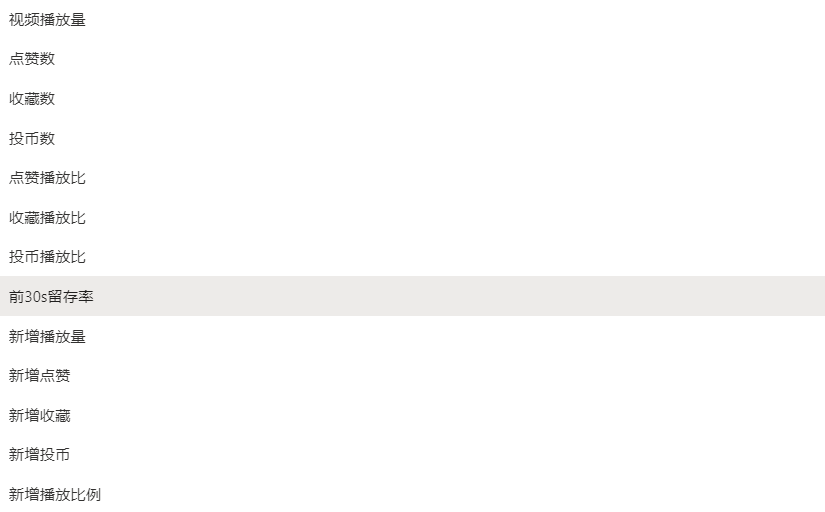

# bilibili Tool

B 站创作中心数据统计工具

## 特点

- 调用本地 Chrome，弹出官方页面登录(扫码/密码登录)，并将登录态保存在本地

- 从 B 站创作中心爬取当天所有数据并保存在本地。

- 展示单个视频多种基础数据、点赞/投币/收藏与播放比例、留存率随时间变化的趋势。

## 获取方法

可以选择直接下载或者自己进行编译

### 直接使用二进制文件

从 [Release](https://github.com/ZhenlyChen/bilibiliTool/releases) 中下载

### 自行编译

```bash
# 编译服务端
go build

# 编译前端
cd web
npm run build
```

## 使用

使用前提：需要安装 Chrome 浏览器，如果本地的 Chrome 未安装在默认路径，则在执行程序目录下新建一个`chrome.ini`文件并输入完整的 Chrome 路径。

直接运行可执行程序，首次使用需在弹出浏览器中完成账号登录。账号信息将保存在本地，绝不会上传。


## 功能

查看实时数据


个人数据分析(目前支持：粉丝、播放量、粉丝增量、播放量增量)


视频数据分析


目前支持以下数据展示：



获取当日数据


## 依赖库

通过 [chromedp](https://github.com/chromedp/chromedp) 调用本地 Chrome 浏览器。

使用 [colly](https://github.com/gocolly/colly) 进行数据请求。

使用 [gin](https://github.com/gin-gonic/gin) 构建本地服务器。

基于 [react](https://github.com/facebook/react) 构建前端。

使用 [fluentui](https://github.com/microsoft/fluentui) 设计前端 UI。
